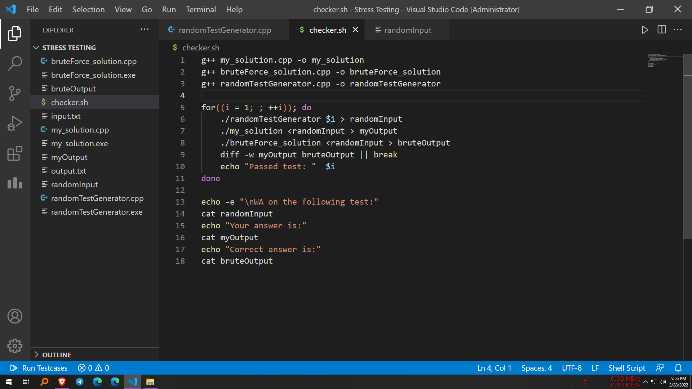
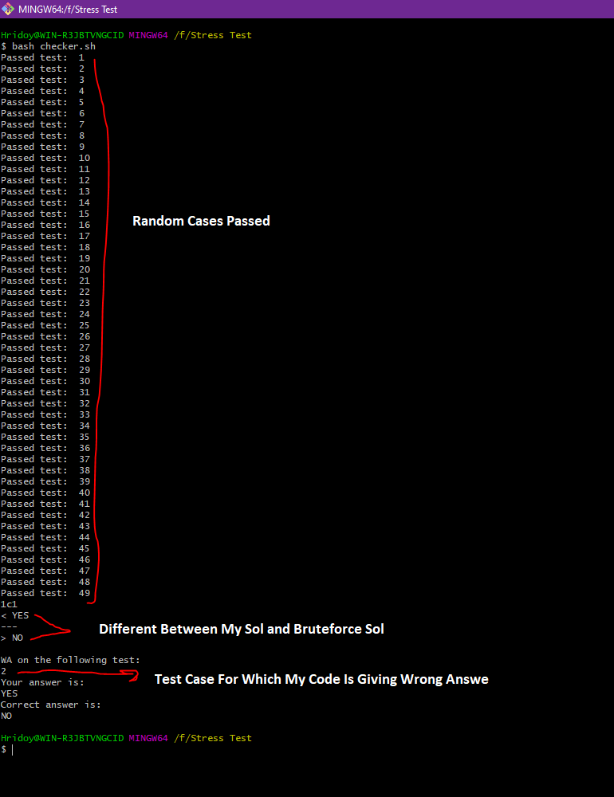

<h3 align="center" >Stress Test Your Solution In Competitive Programming & How To Find Corner Test Cases </h1>

## What For
In Competitive Programming Stress Test Is Very Important. Sometimes Given Test Cases Pass But Some Corner Cases Fail And Not All Judge Show Test Case So It's Hard To Debug Code. If You Put Your Code Under Stress Test It Will Give You Some Corner Case For Which Your Code Is Failing Or Giving Wrong Answer. So With This Stress Test You Can Now Generate Random Test Cases For Your Problem And Check Why Your Code Is Failing And For Which Hidden Test Case.

## How Stress Test Work
First You Need To Understand The Problem Fully Then You Need To Write An Accurate Bruteforces Solution For This Problem And Then You Need To Compare Your Actual Solutions Answer With The Bruteforces Solutions. If Both Of The Answer Match Then Your Code Is Fine In Stress Test But If Your Code Generate Different Answer For A Test Case Then Your Code Is Failed In Stress Test.

## How To Use Steps By Steps

   
     
   <b>Here Is My Actual Approach/Solution</b> 
     
    <b>After Submitting This Solution I Got Error But Don't Know For Which Case</b> 
     
    <b>Here Is The Bruteforce Approach/Solution</b> 
     
    <b>Generating Some Random Numbers For Bruteforces Code Input</b> 
     
    <b>Checker Script For Comparing Both Code And Finding Difference</b> 
     
    <b>Run Gitbash From The Folder And Use This Script <code>bash checker.sh</code></b> 
     
    <b>Found Hidden Case For Which Code Failing</b> 
     
    <b>After Fixing Failed Test Case Got AC</b> 

